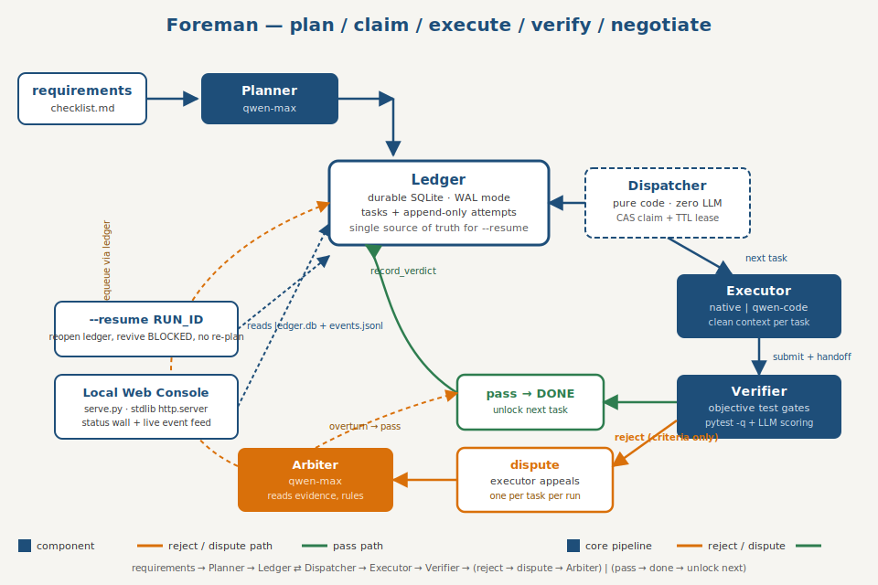
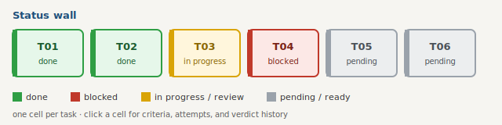

# Foreman — an AI foreman that makes coding agents actually finish long checklists

> Give a coding agent a 20-item requirements checklist that should take a full
> day, and after an hour it declares "all done" — having actually finished
> three of them. Feed the *same* list one item at a time, verify each before
> moving on, and every item gets done properly. **Foreman automates the
> second workflow**: it plans the checklist into small verifiable tasks, hands
> each one to an executor with a clean context, and refuses to call anything
> done until an independent verifier proves it.



Built for the **Qwen Cloud Global AI Hackathon — Track 3: Agent Society**.
Foreman is a multi-agent system whose agents divide labor, negotiate over
rejected work, and resolve execution conflicts — with a **measured
completion-rate gain over single-agent baselines on the same frozen exam**
(see [Evaluation](#evaluation)).

## Positioning

MetaGPT, ChatDev, and similar frameworks optimize **code-generation quality
from one prompt** — good architecture, good SOP roleplay, one shot at a
whole app. Foreman optimizes something else: **execution fidelity of a long
checklist** — did the 17th requirement actually get implemented and proven,
not just claimed. That means verification loops instead of a single review
pass, negotiation when a verdict is disputed, and a durable ledger instead of
conversation memory. Foreman is not a fork of MetaGPT/ChatDev or any other
project; the task-DAG-plus-verifier-gate design was built directly against
the failure modes below.

## Why long tasks fail (and what Foreman does about it)

Every design choice below answers a *measured* failure mode, not a hunch:

| Failure mode | Evidence | Foreman's mechanism |
|---|---|---|
| Long-horizon ceiling | METR 2025: frontier models finish tasks needing >4h of human work in <10% of attempts; task-length "half-life" ~50–59 min | Planner splits the checklist into small, independently verifiable tasks |
| Error compounding | 90% per-step accuracy over 12 steps → <28% end-to-end (Toby Ord, arXiv:2505.05115) | Each task is verified independently; errors don't silently propagate as "facts" |
| Context rot | Chroma 2025: 18 frontier models incl. Qwen degrade non-uniformly as input grows; Lost in the Middle (arXiv:2307.03172) | Every executor works in a **clean context** — only its task card + upstream handoffs |
| Premature completion | "Early termination (overconfidence)" is a named, measured failure mode (~6.2% of failures) | An **independent verifier** rules; the executor cannot flip its own done-flag |
| Instruction overload | Multi-task prompts drop format compliance 2–21%; one-shot planning loses to as-needed decomposition (ADaPT, NAACL'24: 17% vs 44% on WebShop) | One task card is dispatched at a time |
| Unreliable self-review | CRITIC (arXiv:2305.11738): without external tool feedback, LLM self-correction is unreliable; LLM-judge agreement caps around ~80% | Verifier runs real build/test/lint gates **before** any LLM judgement |
| Runaway retries | Reflexion gains <2% after the 3rd fix attempt; AutoGPT once burned 300+ API calls to zero output | 3-attempt ceiling → escalation ladder, plus a consecutive-failure circuit breaker |
| Multi-agent write conflicts | Observed in production multi-agent coding (Cognition) | Compare-and-swap claims + a single verdict path per task |

This mirrors — and productizes — Anthropic's own guidance on long-running
agents (an external progress file, a completion checklist the agent can flip
but not rewrite, one feature at a time, "kick it back when it claims done").
Foreman took that pattern and added negotiation (dispute/arbitration) and
measurement (the three-condition evaluation harness) on top of it.

## Architecture

```
requirements ─▶ Planner ─▶ [ Ledger ] ◀─ Dispatcher (pure code, zero LLM)
                              │                │ next task (CAS claim + TTL lease)
                              │                ▼
                              │           Executor  (clean context per task)
                              │                │ submit + structured handoff
                              │                ▼
                              └──────────  Verifier (objective gates first, then LLM scoring)
                                               │
                                        reject ─┼─▶ Executor may DISPUTE ─▶ Arbiter rules
                                               │
                                        pass ──┴─▶ DONE ─▶ unlock dependent tasks
```

| Role | Model | Job |
|---|---|---|
| Planner | `qwen-max` | Requirements → dependency-ordered task DAG; every task carries acceptance criteria + a runnable `test_strategy` |
| Dispatcher | pure Python, no LLM | Dependency resolution, atomic compare-and-swap claims, TTL-lease crash recovery, shared account-level rate limiter |
| Executor | `qwen3-coder-plus` (or `qwen-plus`) | One task per clean context via an OpenAI tool-calling loop (`read_file` / `write_file` / `list_dir` / `search_files` / `run_command` / `done`) |
| Verifier | `qwen-plus`, JSON mode | Objective gates (task's own test + a `pytest -q` regression sweep) first, then three-tier LLM scoring of each acceptance criterion |
| Arbiter / Replanner | `qwen-max` | Settles disputes (reads actual evidence files); after the retry ceiling, escalates a task to the replanner |

### Seven-state task machine

`PENDING → READY → IN_PROGRESS → PENDING_REVIEW → DONE → ARCHIVED`, with
`BLOCKED` as the escalation state. Only three transitions are automatic
(dependency satisfied, atomic claim, crash-lease reclaim) — every other move
requires an explicit action, so the machine can never silently mark itself
done. Full transition table in [`docs/ARCHITECTURE.md`](docs/ARCHITECTURE.md).

### Durable ledger + audit trail

The **Ledger** (SQLite, WAL mode) is Foreman's durable memory spine: context
windows rot, an external ledger does not. `tasks` holds current state;
`attempts` is an append-only audit trail — one row per attempt, never
mutated, carrying the full handoff JSON and the verdict text. It is the
single source of truth the status-wall UI renders, the evaluation harness
reads, and `--resume` reopens with no re-planning.

## Negotiation & conflict resolution

This is Track 3's core ask — agents that divide labor *and* negotiate.

**Judgement conflicts (REJECT → DISPUTE → ARBITRATION):** a rejection is
disputable only when every objective gate was green (gate failures are
machine-checked ground truth — rhetoric cannot argue with an exit code). The
executor gets exactly one evidence-based appeal per task per run:
1. `solicit_dispute` asks the executor model whether it wants to contest,
   with concrete evidence files/claims, or concede.
2. If it disputes, the **Arbiter** (`qwen-max`, same tier as the planner —
   deliberately outranks both the disputing executor and the verifier being
   disputed) reads the actual contents of the named evidence files and rules
   `overturn` or `uphold`.
3. Overturn → the task passes. Uphold → the arbiter's clarification is folded
   into the rejection reason so it reaches the executor's next attempt.

**Three real incidents from live runs** (all traceable in the ledgers/events
committed with our development history):

1. *Defective machine-generated gate.* In the very first live run the planner
   emitted a syntactically invalid verification command — an exam no executor
   could ever pass. The system neither rubber-stamped the (actually correct)
   work nor looped forever: it burned its 3-attempt budget and blocked. That
   incident produced two permanent fixes — invalid-gate detection in the
   verifier, and a validation gate on the planner's own output ("everyone
   gets verified, including the examiner").
2. *Executor's test asserted the wrong thing.* In a later run the executor
   wrote a test expecting `'Amount is required'` where the app's validation
   order actually returns `'No JSON data provided'` first. The gate ran the
   test for real, failed it, and the feedback named the exact assertion; the
   next attempt fixed it. A single agent grading itself would have shipped
   that test.
3. *Test-isolation bug caught by the gate.* In the evaluation run (Condition
   C, T04) the gate failed because stale rows from earlier test runs leaked
   into `/expenses` (12–16 rows where 2 were expected). The verifier's
   feedback prescribed the standard fix (fresh in-memory DB per test); the
   next attempt healed it.

**Execution conflicts:** the dispatcher's compare-and-swap claim means two
workers can never hold the same task; a TTL lease means a crashed worker's
task is automatically reclaimed rather than stuck `IN_PROGRESS` forever; a
consecutive-failure circuit breaker escalates a task to `BLOCKED` instead of
retrying indefinitely.

## Evaluation

**Protocol:** same frozen checklist, same executor model, same tools, one
independent referee — `scripts/evaluate.py` + `scripts/referee.py`. The
checklist is planned **once** with the real Planner into a frozen `exam.json`
so every condition is judged against literally the same task list. The
referee re-runs each task's own `test_strategy` directly against the
filesystem plus one blanket `pytest -q` sweep — no LLM judgement, and
Foreman's own Verifier verdicts are never used for the cross-condition score
(a system should not grade its own exam).

- **Condition A** — single-agent one-shot: the entire checklist as one task,
  one `Executor.execute` call, `max_iters=60`, no verifier, no retries. This
  reproduces "here are N requirements, go."
- **Condition B** — sequential feeding, no verification: one executor call
  per exam task in dependency order, `max_iters=15` each; whatever comes back
  is accepted unconditionally. Isolates decomposition alone from
  decomposition + verification.
- **Condition C** — full Foreman: same frozen exam tasks, normal
  verifier/retry/dispute loop.

Run on `demo/requirements_mini.md` (5 tasks), `2026-07-04`
(`evals/results_20260704T080344Z.json`):

| Condition | Referee pass | Wall-clock (s) | Executor attempts | Total tokens |
|---|---|---|---|---|
| A — single-agent one-shot | 0/5 (overall `pytest -q`: PASS, but wrong test filenames) | 136 | 1 | 75,253 |
| B — sequential, no verification | 4/5 | 218 | 5 | 112,912 |
| C — full Foreman | 5/5 (T04 rejected once, healed on attempt 2) | 461 | 6 | 267,193 |

Honest cost framing: full verification (C) costs roughly **2.4x** the
tokens of sequential-no-verify (B) and **3.5x** Condition A, in exchange for
going from 0-4/5 referee-passed to 5/5.

### Threats to validity

- **Single runs, not averages.** LLM sampling variance means a rerun can
  shift these numbers; treat this as one data point, not a definitive
  ranking (the harness prints this same caveat with every table).
- **Condition A's 0/5 is partly a naming artifact.** The referee's
  `test_strategy` expects specific filenames (`test_health_check.py`, etc.);
  Condition A wrote its own tests to `test_app.py` instead. The per-requirement
  test-file naming law (`test_reqNN.py`, requirement N) was added to the
  delivery spec afterward specifically to make cross-condition filenames
  comparable — this run predates that fix being exercised end-to-end, so
  A's true single-shot completion rate is likely better than 0/5 but still
  clearly behind B and C on the tasks that matter (auth, filtering,
  pagination — the harder items later in a full 20-item checklist).
- **Training-data familiarity.** Flask + SQLite CRUD is a common pattern the
  underlying Qwen models may have seen heavily in pretraining/fine-tuning;
  results on a less common stack could look different.
- **The weaker executor still hit 5/5.** Condition C used `qwen-plus`
  (not the stronger `qwen3-coder-plus` executor tier) and still reached
  5/5 referee-passed — evidence that the orchestration loop, not raw model
  strength, is doing the compensating.

## Quickstart

No API key needed for the orchestration core:

```bash
python demo/smoke_run.py                                          # fake executor/verifier, watch the loop
python main.py --checklist demo/requirements_mini.md --mock        # same loop via main.py's CLI
```

Run the test suite (231 tests: concurrency safety, retry ladder, crash
recovery, dispute/arbitration, resume, git safety rails, command policy,
web API, Console v2 telemetry/pricing/stop-resume/config):

```bash
python -m pytest -q
```

Real run with the web console (requires `DASHSCOPE_API_KEY` in `.env`):

```bash
start_foreman.bat            # Windows: installs deps, checks .env, opens the console
./start_foreman.sh           # macOS/Linux: same thing
python serve.py               # or directly; add --no-browser for headless environments
```

### Product Console v2

The console (`http://127.0.0.1:8787`) is a full-featured control room, not
just a status wall:



- **Per-role model selectors** in the New Run form (planner/executor/
  verifier), each with a "custom…" option for any DashScope model name not in
  the known list — no code change needed to try a new model.
- **Parallel runs**: start several checklists back to back; the run list
  polls every 3s and shows a status dot (green done / amber active / red has
  blocked tasks / grey idle) plus a `MOCK` chip for demo runs.
- **Stop (task-boundary graceful) + Resume**: Stop writes a sentinel the
  orchestrator checks between tasks — an in-flight executor attempt always
  finishes before the loop halts. Resume reopens the same ledger and
  continues with no re-planning.
- **Per-run live cost accounting**: a `≈$0.0123 · 45,678 tok` readout on the
  run header, backed by thread-local per-run token tagging (see
  [Console v2 architecture](docs/ARCHITECTURE.md#console-v2)) plus a rough
  USD estimate (`foreman/pricing.py`).
- **Workspace zip download** and **run archive** (moves a finished run out of
  the active list without deleting it).
- **Requirements templates**: the New Run form's template dropdown loads
  straight from `demo/*.md`.
- **Config health panel**: `/api/config` reports whether `DASHSCOPE_API_KEY`
  is present and a masked preview (`sk-abcde…yz`) — the full key is never
  sent to the browser.

**Demo mode — the full console experience with zero API key.** Check "Demo
mode" in the New Run form (or POST with `"mock": true`) and every one of the
features above — parallel runs, stop/resume, cost accounting, download,
archive — runs against a scripted fake planner/executor/verifier that never
touches the network. Judges can try the entire product in seconds without a
DashScope key. A mock run normally finishes in well under a second, which is
too fast to watch fill in on camera; set `FOREMAN_MOCK_DELAY=<seconds>`
(clamped to 0–30) before starting the console, or pass
`"mock_delay_s": <seconds>` in the `POST /api/runs` body, to slow every mock
execute()/verify() call down to a filmable pace:

```bash
# CLI: watch a mock run pace itself instead of finishing instantly
python main.py --checklist demo/requirements_mini.md --mock --mock-delay 0.5

# Console: set once before start_foreman.bat / serve.py, applies to every mock run
set FOREMAN_MOCK_DELAY=4
start_foreman.bat

# Or per-request via the API directly:
curl -X POST http://127.0.0.1:8787/api/runs -d "{\"requirements\":\"1. step one\n2. step two\",\"mock\":true,\"mock_delay_s\":4}"
```

The console shows a four-color status wall (one cell per task), a live event
feed, and surfaces `DISPUTE`/`ARBITRATION` events with an amber badge —
negotiation is meant to be visible, not a hidden retry.

Resume an interrupted run (no re-planning; picks up from the ledger):

```bash
python main.py --resume run_xxxxxxxxxxxx
```

Run the three-condition evaluation yourself:

```bash
python scripts/evaluate.py --checklist demo/requirements_mini.md --conditions ABC --out evals/
```

## Working on an existing project

Foreman can also point the Executor at a real git repository instead of a
fresh sandbox — same planner/executor/verifier/dispute loop, but the
workspace *is* your repo. Use `--project-dir C:\path\to\repo` on the CLI, or
fill in "Existing project folder" (plus its confirmation checkbox) in the web
console's New Run form. The safety model: the folder must already be a git
repo, ideally clean; Foreman works on an isolated `foreman/<run_id>` branch
and commits once per completed task; **your main branch is never touched**,
and Foreman never merges or pushes — review and merge it yourself. See
[`docs/EXISTING_PROJECTS.md`](docs/EXISTING_PROJECTS.md) for the full guide,
including the `--force-dirty` escape hatch.

## Status

- [x] Task-DAG planner + zero-LLM dispatcher + durable SQLite ledger
- [x] Clean-context executor with a jailed workspace + tool-calling loop
- [x] Objective-gate-first verifier (real tests before any LLM opinion)
- [x] Dispute/arbitration negotiation layer (one appeal per task)
- [x] Resume from ledger (no re-planning)
- [x] Three-condition evaluation harness (A/B/C) with a frozen exam
- [x] Local web console (status wall, live event feed, drawer)
- [x] Product Console v2: per-role model selectors, parallel runs, stop/
      resume, per-run live cost accounting, workspace download, run archive,
      requirements templates, config health panel
- [x] Demo mode: full console experience with zero API key, plus
      `FOREMAN_MOCK_DELAY`/`mock_delay_s` pacing for filming
- [x] Existing-project mode hardened by adversarial audit: non-overridable
      mid-merge/rebase rejection, pre-existing-branch refusal, per-repo run
      lock, force-dirty work snapshotted as its own labeled commit
- [x] `search_files` executor tool — content search (grep) so the executor
      orients in a real codebase before editing instead of reading it wholesale
- [x] `web_search` executor tool — live internet search (DuckDuckGo, no key),
      failures come back as readable tool results, never crashes
- [x] Pluggable executor backends: native tool-loop (default), Alibaba's
      qwen-code CLI, and NousResearch's **hermes-agent** — plus Foreman
      registered as a Hermes *skill*, so the integration runs both ways
      (see [docs/HERMES.md](docs/HERMES.md))
- [x] Test suite green (238 tests, no API key required)
- [ ] 20-item full-checklist evaluation (quota-gated — needs a live
      DashScope run against `demo/requirements_full.md`)
- [ ] Function Compute deployment proof (steps are written in
      [`docs/DEPLOY.md`](docs/DEPLOY.md); not yet executed end-to-end against
      a live FC instance)

## Limitations & roadmap

Known boundaries of a focused v1 — each paired with the direction we'd take it:

- **Greenfield by default, existing-project mode is opt-in.** Without
  `--project-dir` the executor still builds in an isolated sandbox — the
  safest default. Pointing Foreman at a real repo (see
  [Working on an existing project](#working-on-an-existing-project)) is
  gated behind git-safety checks and an isolated per-run branch, exactly
  because editing someone's actual codebase deserves more guardrails than a
  disposable sandbox does. Roadmap: extend the same git-safety model to
  multi-branch/PR workflows (open a PR instead of leaving a local branch for
  manual review).
- **Verification is pytest-oriented.** The objective gate assumes
  `test_strategy` commands are pytest/`python -c` runnable (per the frozen
  planner contract in §5 of `docs/CONTRACTS.md`). Roadmap: a pluggable gate
  runner so `npm test`, `go test`, or other suites qualify as first-class
  objective gates, not just an ad-hoc shell command.
- **Single-node SQLite ledger.** This is a deliberate choice for a local,
  double-click tool — WAL mode gives concurrent reads for the console for
  free, with zero infra to stand up. Roadmap: the ledger already sits behind
  one interface (`foreman/ledger.py`), so scale-out is a backend swap
  (Postgres/etcd-backed claim semantics), not a rewrite of the orchestrator.
- **Evaluation is demo-scale.** The three-condition harness has been run
  end-to-end on a 5-item checklist (5/5 referee-passed, see
  [Evaluation](#evaluation)); the 20-item full checklist is planned but
  pending a live quota-unblocked run. Roadmap: run
  `scripts/evaluate.py` against `demo/requirements_full.md` once quota
  allows, and publish the full A/B/C table alongside the 5-item result rather
  than replacing it.

## Qwen Cloud / Alibaba Cloud integration

Foreman talks to Qwen through the **DashScope international endpoint in
OpenAI-compatible mode** — no vendor SDK beyond `openai`. Model routing is
per-role (planner/arbiter on `qwen-max`, executor on
`qwen3-coder-plus`/`qwen-plus`, verifier on `qwen-plus` in JSON mode) and
overridable via environment variables so the DashScope catalog can drift
without a code change.

### Provider switch: free Gemini fallback

Because the same OpenAI-compatible surface serves both, a single env var
repoints every role at Google AI Studio's free tier when DashScope quota is
gone: `FOREMAN_PROVIDER=gemini` + `GEMINI_API_KEY`. The code default stays
Qwen (the hackathon target and the committed evaluation evidence); Gemini is
the "keep working when the free quota runs dry" escape hatch. Free tiers
rate-limit hard (Gemini is ~5 requests/minute), so `create_with_fallback`
now parses a 429's `retryDelay` and waits out the per-minute window on the
same model — a run slows down but does not die (surfaced as `rate_limit_wait`
events). See [`foreman/config.py`](foreman/config.py).

### Hermes integration — Foreman as a multitasking engine

Foreman also composes with [hermes-agent](https://github.com/NousResearch/hermes-agent)
in both directions (see [docs/HERMES.md](docs/HERMES.md)): Hermes can drive
Foreman as its **execution backend** (`FOREMAN_EXECUTOR_BACKEND=hermes` runs
each task through a headless `hermes -z`), and Foreman ships as a **Hermes
skill** so a Hermes user handing over a long checklist gets it planned,
verified, and resumed by Foreman while Hermes remains the agent that actually
executes each task. `--computer-mode` points Foreman's workspace at the real
machine (any folder, command policy off, no git) for "operate my computer"
tasks that have no test to gate on.

Integration files: [`foreman/config.py`](foreman/config.py) (`.env` loading,
`Settings`, the DashScope client factory) and [`foreman/llm.py`](foreman/llm.py)
(shared `chat_json` helper handling DashScope's JSON-mode and code-fence
quirks, plus token metering).

## Deployment on Alibaba Cloud Function Compute

See [`docs/DEPLOY.md`](docs/DEPLOY.md).

## License

Apache-2.0 — see [LICENSE](LICENSE).

## Acknowledgments

Design basis draws on: METR's 2025 long-horizon task evaluations; Toby Ord's
error-compounding analysis (arXiv:2505.05115); Chroma's 2025 context-rot
study and "Lost in the Middle" (arXiv:2307.03172); the ADaPT decomposition
paper (NAACL 2024); CRITIC (arXiv:2305.11738); Reflexion's retry-diminishing-returns
findings; AutoGPT's documented runaway-retry incident; Cognition's writeup
on multi-agent write conflicts; and Anthropic's published guidance on
long-running agents.
