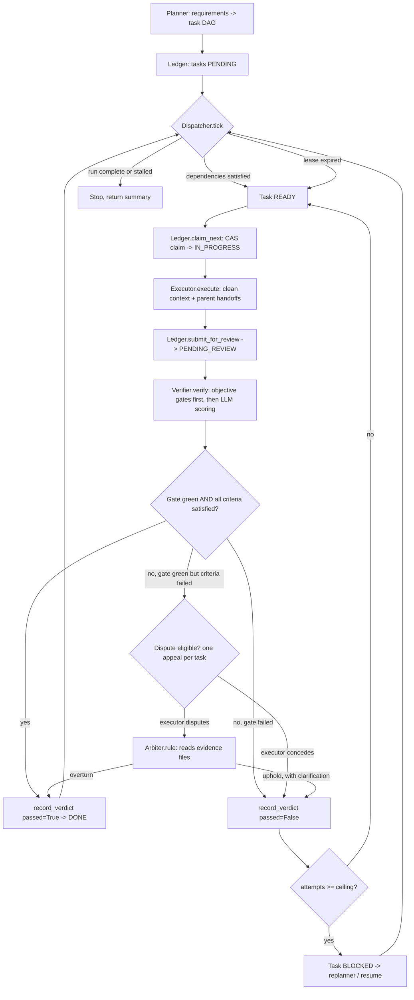

# Foreman — Architecture

This is the deeper dive companion to the [README](../README.md): module
responsibilities, the state machine's exact transition table, the event
stream format, and a full sequence walkthrough of one task's journey
including a rejection and a dispute. The frozen interface contracts these
modules implement live in [`CONTRACTS.md`](CONTRACTS.md); read that alongside
the actual source under `foreman/` — it is the source of truth for types.

## Module map

**`foreman/models.py`** — Dependency-free (stdlib only) core data model:
`Task`, `Handoff`, `TaskStatus`, `AttemptOutcome`, `CriterionStatus`, and the
`ALLOWED_TRANSITIONS`/`AUTOMATIC_TRANSITIONS` tables that define the task
state machine. Deliberately has zero knowledge of LLMs, SQLite, or HTTP, so
the state machine itself can be unit-tested and reasoned about in isolation.

**`foreman/ledger.py`** — The durable memory spine. Wraps a SQLite database
(WAL mode) with two tables: `tasks` (current state) and `attempts`
(append-only audit trail, one row per attempt, never mutated). Owns every
legal state transition (guarded through `models.is_transition_allowed`), the
compare-and-swap claim (`claim_next`), lease-expiry crash recovery
(`reclaim_expired`), and the retry ladder inside `record_verdict`. This is
the one place concurrency safety and the retry ceiling are actually enforced
— everything upstream just calls into it.

**`foreman/dispatcher.py`** — Deterministic scheduling with zero LLM calls.
Each `tick()` reclaims crashed leases, promotes tasks whose dependencies just
became satisfied, and reports whether the run is complete or stalled. Also
hosts `TokenBucket`, a thread-safe rate limiter shared across executors
because DashScope enforces limits per account, not per API key.

**`foreman/config.py`** — Loads `.env` (no third-party dotenv dependency) and
builds `Settings` (API key, base URL, per-role model names) plus the
DashScope-pointed OpenAI-compatible client factory (`make_client`). Model
names are environment-overridable because the DashScope catalog drifts.

**`foreman/llm.py`** — Shared `chat_json` helper used by Planner, Verifier,
and Arbiter: forces JSON-mode-compatible messages, strips ```json code fences
models sometimes wrap output in, retries once on a parse failure by quoting
the malformed output back, and records token usage into the shared
`telemetry.METER`.

**`foreman/planner.py`** — Turns a requirements checklist into a task DAG.
Enforces atomicity ("one-sentence, no 'and'"), individually-checkable
acceptance criteria, and a concrete, offline-runnable `test_strategy`
(`python -m pytest <file>::<node> -q`, never `python -c` or a live server).
Anything the model would rate complexity ≥5 should already be split.

**`foreman/workspace.py`** — A jailed filesystem + shell for one executor's
attempt. Every path resolves against `self.root` and is rejected if it would
escape (`..` climbing, absolute paths, symlink tricks); every shell command
runs with `cwd` pinned to that root. Output is truncated to `MAX_OUTPUT`
(10,000 chars) so a runaway command can't blow the next turn's context. This
is the one place model-generated strings touch the real filesystem.

**`foreman/executor.py`** — The only module that talks to Qwen to *produce*
work. Runs an OpenAI function-calling loop (`read_file`, `write_file`,
`list_dir`, `run_command`, `done`) against one task card, its dependency
handoffs, and — on a retry — the verifier's exact complaint. No planner
chatter, no other task's history: that isolation is what keeps a long run
coherent. Ends when the model calls `done` or hits `max_iters`; returns a
structured `Handoff`.

**`foreman/verifier.py`** — Decides whether a handoff actually satisfies a
task. Objective signals first: the task's own `test_strategy`, then a
blanket `python -m pytest -q` regression sweep if a test suite already exists
in the workspace (so task N's fix can't silently break task N-1's tests). A
non-zero gate always rejects regardless of LLM opinion; only after both
gates report their exit code does the model score each acceptance criterion
on the three-tier scale (`satisfied` / `partially_satisfied` / `not_satisfied`).

**`foreman/arbiter.py`** — The negotiation layer. `solicit_dispute` asks the
executor model whether it wants to contest a rejection with concrete
evidence or concede. `Arbiter.rule` (a stronger, planner-tier model) reads
the actual contents of the named evidence files and rules `overturn` or
`uphold` — explicitly told gate results are not up for debate, only the
verifier's criteria scoring is.

**`foreman/orchestrator.py`** — Wires everything into the single
claim → execute → submit → verify → (dispute) → record loop. Owns the run's
durable artifacts (ledger DB, workspace directory, append-only
`events.jsonl`) and reconstructs parent handoffs from the ledger's attempt
history rather than keeping them in memory — a task's executor never sees
anything a fresh process reading the ledger wouldn't also see. `run_checklist`
plans and runs; `run_tasks` skips planning (used by the evaluation harness so
every condition shares one frozen exam); `resume_run` revives `BLOCKED` tasks
and re-enters the same loop with no re-planning.

**`foreman/telemetry.py`** — `TokenMeter`: a process-wide, thread-safe
singleton (`METER`) recording per-model prompt/completion tokens and call
counts. Every module that talks to the model records into it rather than
threading a return value through every call site; the evaluation harness
resets it, runs one condition, and snapshots it for an honest cost
comparison.

**`foreman/webui_data.py`** — Read-only data-access layer for the local web
console. Plain functions taking a run directory and returning
JSON-serializable dicts; no socket code, so it's directly unit-testable.
Reads are always fresh (a new sqlite3 connection + a fresh read of
`events.jsonl` per call) — safe because the ledger runs in WAL mode.

**`main.py`** (repo root) — CLI entry point: `--checklist` (plan + run,
optional `--mock` for a zero-API-key fake executor/verifier) or `--resume
RUN_ID`. Prints the ASCII status wall after each verdict.

**`serve.py`** (repo root) — Stdlib-only HTTP server
(`http.server.ThreadingHTTPServer`) serving the single-file console UI and a
small JSON API under `/api/`, all backed by `webui_data`. `POST /api/runs`
starts a real `Orchestrator` run on a daemon thread and returns the run_id
immediately.

## State machine transition table

Seven states (`foreman/models.py`):

| State | Meaning |
|---|---|
| `PENDING` | Created; waiting on dependencies |
| `READY` | Dependencies satisfied; free to claim |
| `IN_PROGRESS` | Claimed by an executor, being worked on |
| `PENDING_REVIEW` | Executor submitted; awaiting the verifier |
| `DONE` | Verifier passed it |
| `BLOCKED` | Retries exhausted; awaiting the replanner |
| `ARCHIVED` | Run finished |

Legal transitions (`ALLOWED_TRANSITIONS`) — a move not listed here is
rejected by the ledger with `TransitionError`:

| From | To | Trigger |
|---|---|---|
| `PENDING` | `READY` | dispatcher: all parents `DONE` (automatic) |
| `PENDING` | `BLOCKED` | (reserved for future replanner-side moves) |
| `READY` | `IN_PROGRESS` | ledger: atomic CAS claim (automatic) |
| `READY` | `PENDING` | (reserved) |
| `READY` | `BLOCKED` | (reserved) |
| `IN_PROGRESS` | `PENDING_REVIEW` | executor: `submit_for_review` |
| `IN_PROGRESS` | `READY` | dispatcher: lease expired / crash reclaim (automatic) |
| `IN_PROGRESS` | `BLOCKED` | too many consecutive failures |
| `PENDING_REVIEW` | `DONE` | verifier passed |
| `PENDING_REVIEW` | `READY` | verifier rejected, retries remain (requeue) |
| `PENDING_REVIEW` | `BLOCKED` | verifier rejected, retries exhausted |
| `BLOCKED` | `PENDING` | replanner: `revive_blocked` |
| `BLOCKED` | `READY` | replanner (direct revive path) |
| `DONE` | `ARCHIVED` | run finalized |
| `ARCHIVED` | — | terminal, no transitions out |

Only three transitions are **automatic** (`AUTOMATIC_TRANSITIONS`) — the
dispatcher performs these without any explicit tool call:
`PENDING → READY` (dependencies satisfied), `READY → IN_PROGRESS` (atomic
claim), `IN_PROGRESS → READY` (crashed lease reclaimed). Every other
transition requires an explicit action from the verifier, executor, or
replanner — a deliberate guard against a task silently marking itself done.

The retry ladder lives inside `Ledger.record_verdict`: `DEFAULT_MAX_ATTEMPTS
= 3` (Reflexion's diminishing returns past the 3rd fix motivate this
ceiling); on rejection, `attempt_count >= max_attempts` routes to `BLOCKED`
instead of `READY`. `DEFAULT_FAILURE_CEILING = 2` governs the
consecutive-failure circuit breaker for crash/lease-expiry paths.

## Event stream format

Every state change appends one JSON line to `runs/<run_id>/events.jsonl` —
the append-only feed the web console polls and the future SSE layer would
tail:

```json
{"ts": 1751600000.123, "type": "claim", "task_id": "T04", "detail": {"attempt": 1}}
```

`type` is one of: `plan`, `claim`, `submit`, `verdict`, `promote`, `reclaim`,
`dispute`, `arbitration`, `revive`, `error`. `detail` shape varies by type —
e.g. `verdict` carries `{passed, new_status, reason, coverage_rate}`;
`dispute` carries `{rebuttal, evidence_files}`; `arbitration` carries
`{ruling, reasoning}`.

## Sequence walkthrough: one task's journey (with a rejection and a dispute)

Concrete example, task `T04` ("GET /expenses returns all expenses as JSON,
newest first") from the mini-checklist eval run:

1. **`plan`** — Planner emits T04 with `parents: ["T03"]`,
   `test_strategy: "python -m pytest test_list_expenses.py -q"`.
2. **`promote`** — once T03 reaches `DONE`, the dispatcher's next `tick()`
   sees T04's only parent satisfied and flips `PENDING → READY`.
3. **`claim`** — `Ledger.claim_next` wins the CAS race, flips
   `READY → IN_PROGRESS`, stamps a 900s lease, `attempt_count` becomes 1.
4. Orchestrator reconstructs T03's handoff from the ledger's attempt history
   and calls `Executor.execute(T04, [handoff_T03])` in a clean context. The
   executor writes `app.py` changes + `test_list_expenses.py`, runs it, calls
   `done`.
5. **`submit`** — `Ledger.submit_for_review` flips
   `IN_PROGRESS → PENDING_REVIEW`, records attempt #1 (outcome `SUCCESS`
   pending verdict) with the handoff JSON in `attempts.summary`.
6. **Verifier** runs the objective gate (`test_list_expenses.py`) — say it
   fails on attempt 1 (e.g. wrong sort key). Gate exit code is non-zero, so
   `passed=False` regardless of LLM scoring; the LLM call still runs so the
   executor gets a specific complaint for the retry.
7. **`_dispute_eligible`** checks: gate was **not** green → not disputable.
   Rejection stands as-is.
8. **`verdict`** — `record_verdict(passed=False, ...)`: attempt_count (1) <
   max_attempts (3), so `PENDING_REVIEW → READY` (requeue), 
   `consecutive_failures` bumped, `last_error` set to the verifier's reason.
9. Next `tick()` promotes T04 back to claimable; it's claimed again
   (`attempt_count` → 2). The executor this time receives `task.last_error`
   verbatim — "fix exactly what it says" is a hard rule in its system
   prompt — corrects the sort key, resubmits.
10. This time the gate is green and every criterion scores `satisfied`.
    **`verdict`**: `passed=True` → `PENDING_REVIEW → DONE`,
    `consecutive_failures` reset. T04 took 2 attempts total (this is exactly
    what the real eval run recorded: `"T04": 2` in
    `evals/results_20260704T080344Z.json`'s `attempts_per_task`).

**Dispute variant** (not what happened to T04, but the general path any
criteria-only rejection can take): suppose at step 6 the gate had instead
passed but the LLM verifier scored one criterion `not_satisfied` on
subjective grounds the executor believes are wrong.

6a. `_dispute_eligible` sees `gate.passed == True` → disputable, and T04 not
    yet in `disputed_task_ids` → eligible.
6b. `solicit_dispute` asks the executor model: dispute or concede? Say it
    disputes, naming `app.py` lines as evidence that the criterion actually
    is met.
6c. **`dispute`** event emitted (rebuttal + evidence files). T04 added to
    `disputed_task_ids` — this appeal is now spent regardless of outcome.
6d. **Arbiter** (`qwen-max`) reads the actual current contents of the named
    evidence files (`workspace.read_file`, capped at 4000 chars each) and
    rules `overturn` or `uphold`.
6e. **`arbitration`** event emitted (ruling + reasoning).
6f. If `overturn`: `record_verdict(passed=True, reason="arbiter overturned: ...")`
    → straight to `DONE`, skipping another executor attempt entirely. If
    `uphold`: `record_verdict(passed=False, reason="<verifier reason> |
    arbiter upheld: <clarification>")` — the clarification reaches the next
    attempt via `last_error` just like an ordinary rejection would, but with
    the added context of what a second, stronger model didn't buy from the
    first plea.

## Loop flowchart


